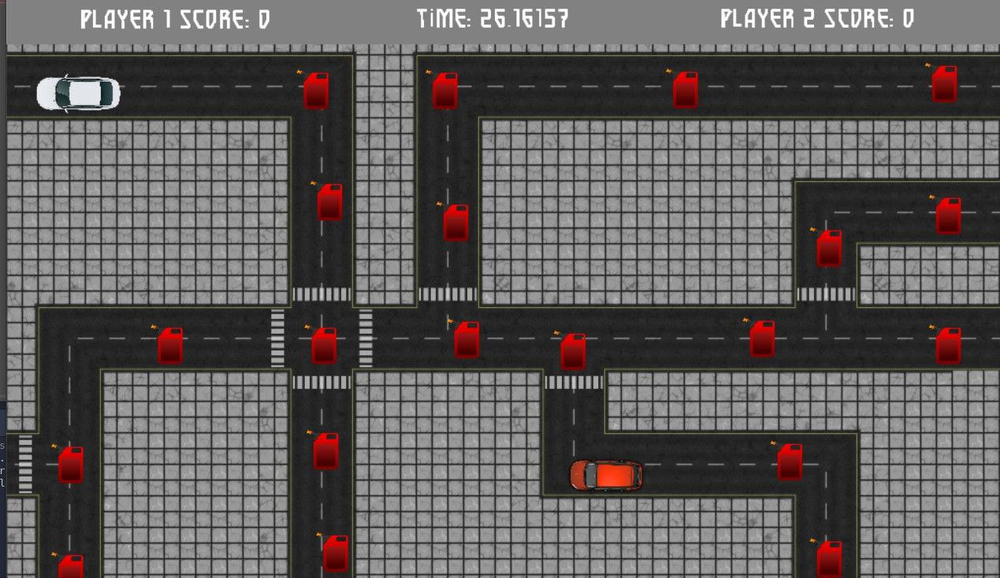

# 🚗 Cars on the Road

A **local multiplayer arcade game** built with **Godot Engine 3.5**.

Two players compete on the same keyboard to collect as many **fuel canisters** as possible before the timer runs out.

---

## 📸 Screenshot

---

## 🎮 Gameplay

Players control cars and drive around the map collecting **fuel canisters** scattered across the roads.

The game lasts **30 seconds**.  
The player who collects **the most fuel canisters** wins.

---

## 🕹 Controls

### Player 1

| Key | Action |
|----|----|
| **W A S D** | Move |

### Player 2

| Key | Action |
|----|----|
| **Arrow Keys** | Move |

---

## 🏆 Objective

- Collect as many **fuel canisters** as possible
- The match lasts **30 seconds**
- The player with the **highest score wins**

---

## ⚙️ Game Mechanics

- Two-player **local multiplayer**
- Score system for collected fuel
- Countdown timer
- Shared keyboard gameplay

---

## 🚧 Future Improvements

Possible improvements for this project:

- Improved **collision models for the cars**
- Adding **collision models for the environment**
- Additional **levels**
- **Sound effects and audio feedback**

---

## 🛠 Engine

- **Godot Engine 3.5**
